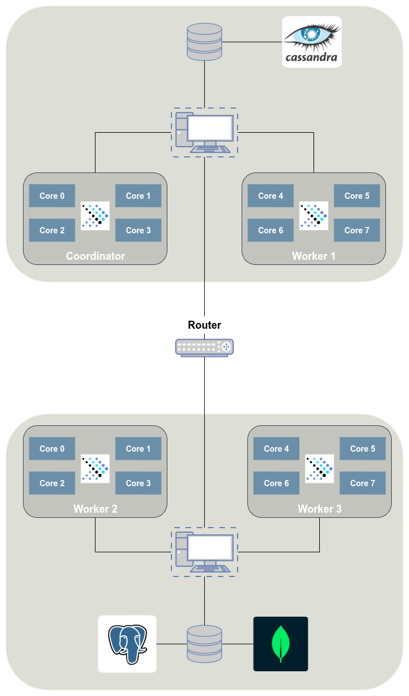

# Benchmarking Distributed SQL Query Execution with PrestoDB

## Introduction

This document provides a comprehensive guide to setting up and benchmarking a PrestoDB cluster with PostgreSQL, Cassandra, and MongoDB as data sources. It covers installing and configuring PrestoDB and the database systems, generating and loading TPC-DS data, and executing queries to evaluate performance across different data distributions.

The goal is to reproduce the experimental setup used in our project and provide ready-to-use scripts and queries for benchmarking PrestoDB in a distributed environment.

---

## Project Contributors

The members of the team behind this project are:

- [Giannis Dimoulas](https://github.com/MastroGiannis)
- [Enrica Iliana Maggiori](https://github.com/ilianamaggiori)
- [Manolis Pantelakis](https://github.com/mpantelakis)

- ---

# Contents

- [PrestoDB](#prestodb)

  - [Installation](#installation)
  - [Configuration](#configuration)
  - [Manual Configuration Edits](#manual-configuration-edits)
  - [Launching](#launching)
  - [Presto CLI](#presto-cli)
  - [Using the Web UI](#using-the-web-ui)

- [Database Systems](#database-systems)

  - [PostgreSQL](#postgresql)
    - [Installation](#installation-1)
    - [Configuration](#configuration-1)
  - [Apache Cassandra](#apache-cassandra)
    - [Installation](#installation-2)
    - [Configuration](#configuration-2)
  - [MongoDB](#mongodb)
    - [Installation](#installation-3)
    - [Configuration](#configuration-3)

- [TPC-DS](#tpc-ds)

  - [Generate Data](#generate-data)
  - [Clean Data](#clean-data)
  - [Loading Data](#loading-data)
    - [PostgreSQL](#postgresql-1)
    - [Cassandra](#cassandra)
    - [MongoDB](#mongodb-1)
  - [Queries](#queries)

- [Benchmarking](#benchmarking)
  - [Running Queries Using the Presto CLI](#running-queries-using-the-presto-cli)
  - [Running Complete Benchmark Tests via Scripts](#unning-complete-benchmark-tests-via-scripts)

---

## PrestoDB

For the purposes of the project, we set up a PrestoDB cluster as shown in the following graph:



The cluster requires **two host PCs**:

- **Host PC 1** → Coordinator + 1 Worker
- **Host PC 2** → 2 Workers

### Installation

Before setting up PrestoDB, ensure that **Java 11+** is installed on the host machines, as Presto requires it.

```bash
# Check if Java 11+ is installed
java -version

# If Java is not installed, install OpenJDK 11
sudo apt update
sudo apt install -y openjdk-11-jdk

# Verify installation
java -version
```

Once Java is installed, proceed to install PrestoDB for each node. using the official tarball distribution. In our setup, we deployed **4 nodes (1 coordinator + 3 workers)** running version **0.293**. Each node was prepared as follows (repeat on each node):

````bash
# Make sure Java 11+ is installed
java -version

```bash
# Download PrestoDB tarball
wget https://repo1.maven.org/maven2/com/facebook/presto/presto-server/0.293/presto-server-0.293.tar.gz

# Extract tarball
tar -xvzf presto-server-0.293.tar.gz

# Rename folder for convenience
mv presto-server-0.293 <node-name> # e.g., coordinator, worker1, worker2, worker3

# (Optional) remove the tarball to save space
rm presto-server-0.293.tar.gz
````

### Configuration

Each node requires creating the following directory structure inside its presto folder:

```bash
presto/
 ├── etc/
 │    ├── config.properties
 │    ├── jvm.config
 │    ├── log.properties
 │    ├── node.properties
 │    └── catalog/
 │         ├── cassandra.properties
 │         ├── mongodb.properties
 │         └── postgresql.properties
 └── data/
```

- **etc/**  
  contains the main configuration files.

- **etc/catalog/**  
  contains the connector definitions (PostgreSQL, MongoDB, Cassandra).

- **data/**  
  used for logs and query runtime information.

- **Configuration files**  
  the specific configuration files for coordinator and workers are provided under the [`prestodb`](./prestodb) folder of the repository. Each node must be configured separately.

### Manual Configuration Edits

Even though the configuration files are provided in the [`prestodb`](./prestodb) folder, some values must be manually updated for your cluster setup:

#### Coordinator

- `config.properties`

  ```properties
  discovery.uri=http://<host-ip-address>:8080
  ```

#### Workers

- `config.properties`

  ```properties
  discovery.uri=http://<coordinator-ip-address>:8080
  ```

#### All Nodes

- `node.properties`

  ```properties
  node.data-dir=/path/to/data/folder
  ```

- `cassandra.properties`

  ```properties
  cassandra.contact-points=<cassandra-host-ip-address>
  ```

- `mongodb.properties`

  ```properties
  mongodb.seeds=<mongodb-host-ip-address>:27017
  ```

- `postgresql.properties`

  ```properties
  connection-url=jdbc:postgresql://<postgresql-host-ip-address>:5432/tpcds
  connection-user=<postgresql-username>
  connection-password=<postgresql-user-password>
  ```

> Make sure to replace all placeholders (e.g., `<coordinator-ip-address>`, `<cassandra-host-ip-address>`) with the actual values for your cluster.

### Launching

Once installation and configuration are complete, PrestoDB can be launched from each node.  
Because each host had **8 CPU cores available**, we bound each node to a set of 4 cores using the `taskset` command to optimize resource usage.

> Note: The following commands must be run from inside the node's Presto folder.

```bash
# Example: bind a node to cores 0-3
taskset -c 0-3 bin/launcher start

# Check node status
bin/launcher status

# Stop the node
bin/launcher stop
```

### Presto CLI

The Presto Command-Line Interface (CLI) allows you to connect to your PrestoDB cluster and execute queries.

#### Installation

Download the Presto CLI executable:

```bash
wget https://github.com/prestodb/presto/releases/download/0.294/presto-cli-0.294-executable.jar
```

Rename the file for convenience and make it executable:

```bash
mv presto-cli-*-executable.jar presto
chmod +x presto
```

#### Connecting to Presto

Run the CLI and connect to your coordinator:

```bash
./presto --server <coordinator-ip>:8080
```

- Replace `<coordinator-ip>` with the IP address of your Presto coordinator node.

- By default, the CLI connects to the `default` catalog and schema; you can specify them using:

```bash
./presto --server <coordinator-ip>:8080 --catalog <catalog-name> --schema tpcds
```

### Using the Web UI

PrestoDB provides a Web UI that allows you to:

- Monitor query progress, execution times, and cluster resources.
- View detailed query plans and statistics for performance analysis.

Access the Web UI by opening a browser and navigating to:

```bash
http://<coordinator-ip>:8080
```

Replace `<coordinator-ip>` with the public IP address of your Presto coordinator node.

---

## Database Systems

For our project, we used three database systems: **PostgreSQL**, **Cassandra**, and **MongoDB**.

### PostgreSQL

#### Installation

```bash
# Install PostgeSQL
sudo apt update
sudo apt install -y postgresql postgresql-contrib

# Start PostgreSQL service
sudo systemctl start postgresql
sudo systemctl enable postgresql
```

### Configuration

**Create a dedicated Presto user and database**

```bash
# Access PostgreSQL
sudo -u postgres psql

# Create a new user for Presto
CREATE USER presto_user WITH ENCRYPTED PASSWORD '<presto-user-password>';

# Exit PostgreSQL
\q
```

**Edit `postgresql.conf`**

Open the file for editing:

```bash
sudo nano /etc/postgresql/<version>/main/postgresql.conf
```

Edit the following line:

```conf
listen_addresses = '*'
```

Save and exit (`Ctrl+O`, `Enter`, `Ctrl+X`).

**Edit `pg_hba.conf`**  
Open the file for editing:

```bash
sudo nano /etc/postgresql/<version>/main/pg_hba.conf
```

Add the following lines:

```conf
# Default PostgreSQL local login via Unix domain socket
local   all             postgres               peer
local   all             presto_user            md5   # <-- Add this line

# IPv4 local connections
host    all             all             127.0.0.1/32           scram-sha-256
host    all             all        <coordinator-ipv4-subnet>       md5        # <-- Add this line
```

Save and exit (`Ctrl+O`, `Enter`, `Ctrl+X`).

`Restart PostgreSQL` to apply changes:

```bash
sudo systemctl restart postgresql
```

### Apache Cassandra

#### Installation

```bash
# Install Cassandra
curl -o /etc/apt/keyrings/apache-cassandra.asc https://downloads.apache.org/cassandra/KEYS

echo "deb [signed-by=/etc/apt/keyrings/apache-cassandra.asc] https://debian.cassandra.apache.org 41x main" | sudo tee -a /etc/apt/sources.list.d/cassandra.sources.list

sudo apt-get update

sudo apt-get install cassandra

# Start Cassandra service
sudo systemctl start cassandra
sudo systemctl enable cassandra
```

`Install cqlsh (Cassandra client)`

```bash
# Install pipx using apt
sudo apt install -y pipx
sudo pipx ensurepath

# Install cqlsh using pipx
pipx install cqlsh

# Set pipx's cqlsh as the default
echo 'export PATH=$HOME/.local/bin:$PATH' >> ~/.bashrc
source ~/.bashrc
```

#### Configuration

**Edit `cassandra.yaml`**

Open the file for editing:

```bash
sudo nano /etc/cassandra/cassandra.yaml
```

Edit the following lines:

```conf
listen_address: localhost
rpc_address: 0.0.0.0
broadcast_rpc_address: <host-ip-address>
rpc_keepalive: true
```

Save and exit (`Ctrl+O`, `Enter`, `Ctrl+X`).

`Restart Cassandra` to apply changes:

```bash
sudo systemctl restart cassandra
```

### MongoDB

#### Installation

```bash
# Install MongoDB
sudo apt update
sudo apt install -y mongodb

# Start MongoDB service
sudo systemctl start mongodb
sudo systemctl enable mongodb
```

#### Configuration

**Edit `mongod.conf` to allow connections from Presto nodes:**

Open the file for editing:

```bash
sudo nano /etc/cassandra/cassandra.yaml
```

Edit the following line:

```conf
  bindIp: 127.0.0.1,<host-ip-address>
```

`Restart MongoDB` to apply changes:

```bash
sudo systemctl restart mongodb
```

---

## TPC-DS

For our project, we used a **corrected version** of TPC-DS v2.4, which can be found here: [databricks/tpcds-kit](https://github.com/databricks/tpcds-kit).  
The most recent official version (v3.0) caused **compilation issues** that we could not overcome.

### Generate Data

**Install required packages**:

```bash
sudo apt-get update
sudo apt-get install -y gcc make flex bison byacc git
```

**Compile the TPC-DS toolkit:**

```bash
cd tpcds-kit/tools
make OS=LINUX
```

**Generate the data using `dsdgen`:**

```bash
./dsdgen -SCALE <scale-factor> -DIR <output-directory> -FORCE
```

- Replace `<scale-factor>` with the desired data size (e.g., 1 for 1GB, 10 for 10GB etc).
- Replace `<output-directory>` with the path where you want the generated data files to be stored.

### Clean Data

In the generated TPC-DS data files, an **extra column delimiter** is placed at the end of each row.  
This causes issues when loading the data into the database systems.

To fix this, we provide a **bash cleaning script** located under the [`scripts`](./scripts) directory of the repository.  
It must be executed once **before importing the data** into PostgreSQL, Cassandra, or MongoDB:

```bash
./clean_tpcds_data.sh <path-to-generated-data>
```

### Loading Data

For loading the cleaned TPC-DS data into the database systems, we provide **two Bash scripts** (for PostgreSQL and Cassandra) and **one Python script** (for MongoDB).  
Each script requires editing a few paths before execution. Additionally, you can comment out specific tables in the scripts if you do not wish to import them.

- All **required scripts** are located in the [`scripts`](./scripts) directory of the repository.
- All **supporting folders and files** are provided under the [`tpc-ds`](./tpc-ds) directory of the repository.

#### PostgreSQL

- Requires files from the following folders:

  - `postgresql-fields-files`
  - `postgresql-tpcds-tables`

- Edit the script `import_data_postgresql.sh` to set the correct paths:

```bash
FIELDS_DIR="/path/to/postgresql-fields-files/"
TABLES_DIR="/path/to/postgresql-tpcds-tables"
DATA_DIR="/path/to/tpcds-data"
```

- Run the script:

```bash
./import_data_postgresql.sh
```

#### Cassandra

- Requires files from the following folder:

  - `cassandra-tpcds-tables`

- Edit the script `import_data_cassandra.sh` to set the correct paths:

```bash
SCHEMA_DIR="/path/to/cassandra-tpcds-tables"
DATA_DIR="/path/to/tpcds-data"
```

- Run the script:

```bash
./import_data_cassandra.sh
```

#### MongoDB

- Requires files from the following folder:

  - `mongodb-type-maps`

- Edit the script `import_data_mongodb.py` to set the correct paths:

```bash
TYPEMAPS_DIR = "path/to/mongodb-type_maps"
DATA_DIR = "/path/to/tpcds-data"
```

- Run the script:

```bash
python3 import_data_mongodb.py
```

### Queries

For the purposes of this project, we prepared the TPC-DS benchmark queries to work with **various data distributions** across the cluster and across different database systems.

- The original TPC-DS queries have been **translated into SQL**.
- Queries have been **adapted for each database distribution** used in our setup.
- All query files for each distribution strategy are located under the [`tpc-ds`](./tpc-ds/tpcds-queries) directory.

> **Note:** These queries are ready to run against the corresponding database catalogs in PrestoDB, so you can directly use them for benchmarking without any additional modification.

---

## Benchmarking

After loading the TPC-DS data, you can run the benchmark queries in two ways:

### Running Queries Using the Presto CLI

You can execute individual query files directly via the Presto CLI:

```bash
./presto --server <coordinator-ip>:8080 --catalog <catalog-name> --schema tpcds --file <query-file.sql>
```

- `<coordinator-ip>` → IP of the Presto coordinator.
- `<catalog-name>` → catalog to query (`postgresql`, `cassandra`, or `mongodb`).
- `<schema-name>` → the schema containing the tables:
  - PostgreSQL → `public`
  - Cassandra → `tpcds`
  - MongoDB → `tpcds`
- `<query-file.sql>` → path to the SQL file containing the query.

This method is suitable for **running single queries** or testing specific queries interactively.

### Running Complete Benchmark Tests via Scripts

For running the full set of TPC-DS queries, use the **scripts provided** in the [`scripts`](./scripts) directory of the repository. This approach automates query execution for each database distribution and multiple workers, recording execution results.

The scripts **must be run from the same directory as the Presto CLI** (`./presto`), as they rely on it to execute the queries.

#### Default Behavior

- Each query is executed **5 times by default**:

```bash
NUM_OF_ITERATIONS=5
```

- The scripts generate a **CSV file** containing the execution times for each query.
- You can edit `NUM_OF_ITERATIONS` in the script to change the number of repetitions.
- Make sure to edit `QUERIES_DIR` in the script to point to the location of the query files, for example:

```bash
QUERIES_DIR=/path/to/queries
```

- Make sure to set the `COORDINATOR_IP` variable in the script to the IP address of your Presto coordinator:

```bash
COORDINATOR_IP=<your-coordinator-ip>
```

> `Important:` Ensure that the correct tables and data have been loaded into the databases depending on the distribution method to be benchmarked; otherwise, the queries may fail.
